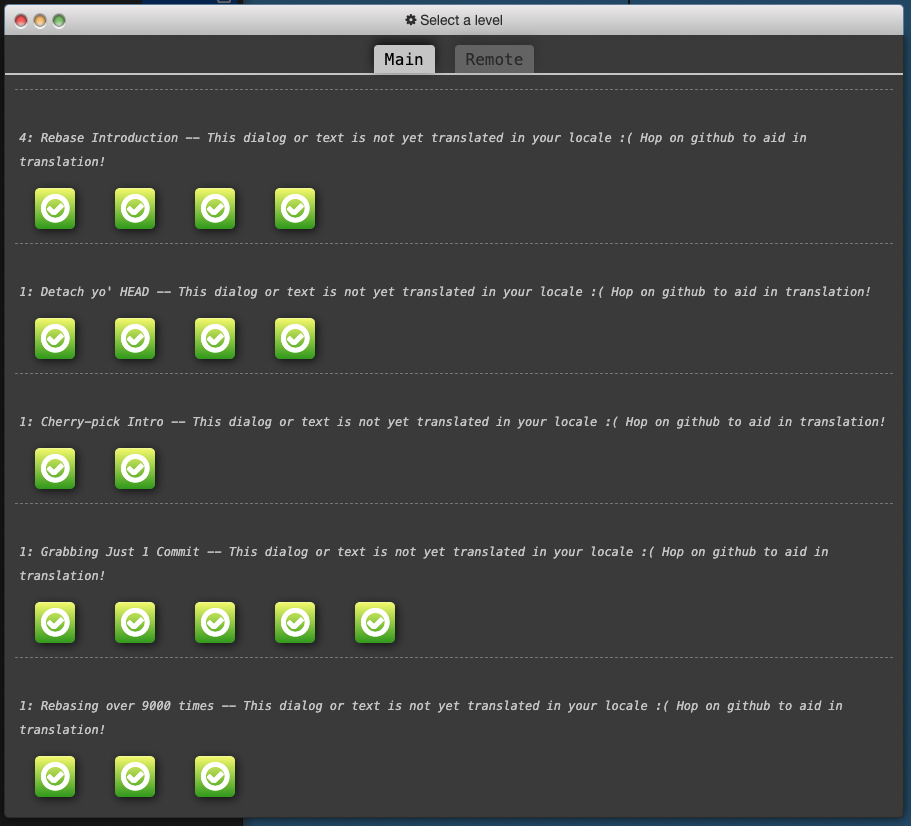
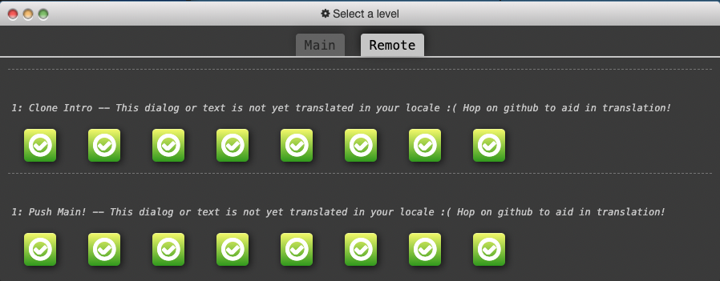
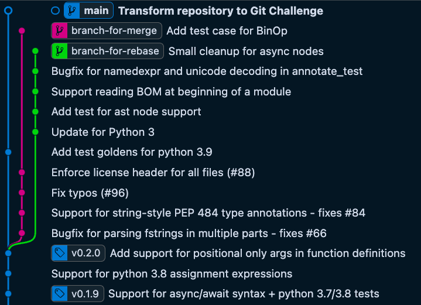
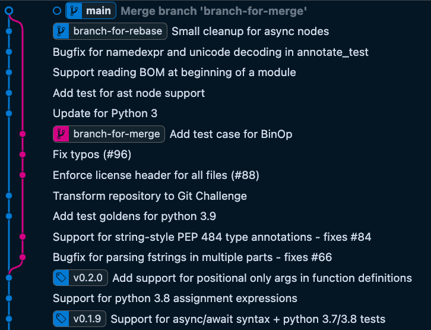
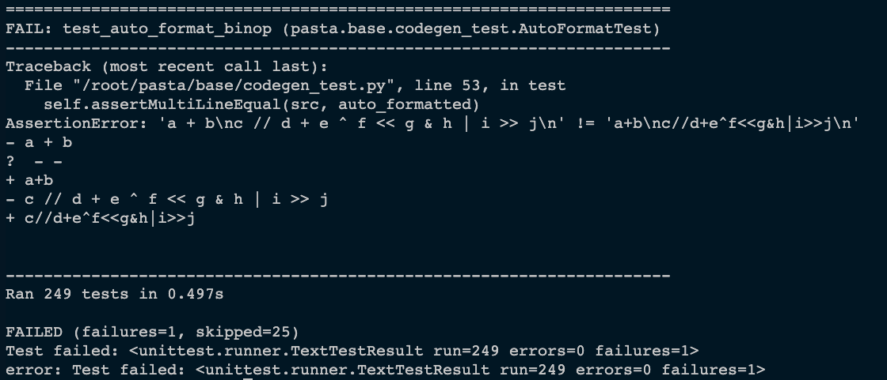
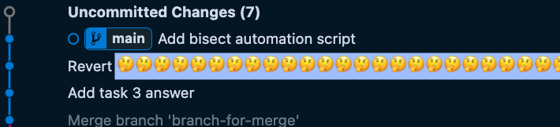

# CS350 Assignment 3: Git Challenge

This challenge is designed to help you practice using Git. You will be asked to complete a series of tasks using Git commands. This challenge is based on a source code history of a Python library, named `pasta`. You will be asked to manipulate its commit history, and search for a buggy change.

## Requirements 
1. Of course, [Git](https://git-scm.com/) must be installed.
   * Clone this repository.
   * Additionally fetch required branches for this assignment using `git fetch origin branch-for-merge:branch-for-merge branch-for-rebase:branch-for-rebase`.
2. You can execute the tests of the program via the command `python setup.py test`, but **ensure that you are using Python version 3.8.10** when you execute the test.
   * If you don't see the expected test output as described below, you may install [Docker](https://www.docker.com/) and run the tests in a Docker container. In this case, use the command `docker run -it --rm --name run-test -v "$PWD":/root/ -w /root/ python:3.8 python setup.py test`.

Before starting your tasks, please verify that all tests pass on the initial HEAD of the main branch (commit message: "Transform repository to Git Challenge"). Again, you must set up the Python environment of version 3.8.10, or there will be unexpected failures due to the version mismatch. The test output of the initial main branch should be the same with the following:
```
...
test_simple_function_def (pasta.base.test_utils_test.CheckAstEqualityTest) ... ok
test_two_globals (pasta.base.test_utils_test.CheckAstEqualityTest) ... ok

----------------------------------------------------------------------
Ran 239 tests in 0.128s

OK (skipped=23)
```

If you see mismatched test output with the followings, we strongly recommend you to use [Docker](https://www.docker.com/).
Specifically, once you have Docker installed in your machine, you can use the command: 
```
docker run -it --rm --name run-test -v "$PWD":/root/ -w /root/ python:3.8 python setup.py test
```
instead of `python setup.py test`.

## Task 1: Git Branching Tutorials
* Git Branching Tutorials: [eng](https://learngitbranching.js.org/?locale=en), [kor](https://learngitbranching.js.org/?locale=ko)
Firstly, all you need is to complete the tutorials provided in the given link (either in English or Korean) and take screenshots of the completed tutorials. For example:




Include these screenshots in your final submission archive.

## Task 2: Rebase, or Merge 
Next, you will be asked to rebase or merge two branches, `branch-for-merge` and `branch-for-rebase`, into the `main` branch. 



Specifically, starting from the status shown in the above figure, you are going to bring the changes in `branch-for-merge` and `branch-for-rebase` into the `main` branch using both `git rebase` and `git merge`. The final status should be in the same structure with the below figure.



Note that **the order of some commits has been changed** during rebasing and merging.

## Task 3: Debugging with Git
After you have completed the previous tasks, you will find that a test fails on the updated main branch (the merge commit).

The test failure message should be like the following (there should be a single failure of the test `test_auto_format_binop`):


Looking through the commit history, the commit with the message "Add test case for BinOp" adds the failed test case, `test_auto_format_binop`. *Then, which past commit was the culprit that caused this test to fail?* A naive way to find the bug-introducing commit is to manually check out each commit and run the test. However, this is quite tedious. Instead, we strongly recommend you to try using `git bisect` to reduce manual inspection.

### Task 3.1: Finding a Bug Introducing Commit
Once you have found the bug-introducing commit, fill out the values in the `task_3_answer.json` file and commit the file. 
```json
{
    "bad_commit_message": "<commit_message_of_the_found_commit>"
}
```

#### Assumptions 
* You can safely assume that the bug was introduced after the commit tagged `v0.1.9`.
* You can also assume that there is only one commit that contains the change that made the test fail.

#### Hints
* Carefully read the documentation of `git bisect`: https://git-scm.com/docs/git-bisect

* `git cherry-pick -n <commit_hash>` applies a change contained in the commit without *committing* it.


### Task 3.2: Reverting the Bug Introducing Commit
After finding the bug introducing commit, Add a fix commit that reverts the bug inducing change, using `git revert`. (Do not modify the default commit message)


### (Bonus Points) Task 3.3: Scripting Partial Procedure of Git Bisect 
You'll get a bonus point if you write a script named `auto_test.sh` which could be provided for an argument of `git bisect run`. Include the script as a new commit on the main branch.

As a result of task 3, we expect you to add some commits each for updating the found commit, reverting the found commit, and optionally, adding the automation script as below.



## Submission Format 
Include the whole git repository, with the screenshot files for task 2, to a zip file named `assignment3-<your_student_id>.zip`. Submit the archive file to KLMS. (Make sure that your git history of your resulting repository is preserved.)
```
assignment3-<your_student_id>.zip
├── cs350-git-challenge # resulting git repository
│   ├── README.md
│   ├── task_3_answer.json
│   ├── auto_test.sh
│   ├── pasta
│   │   ...
├── task_1_screenshot_1.png 
└── task_1_screenshot_2.png # screenshots of the completed tutorial
```